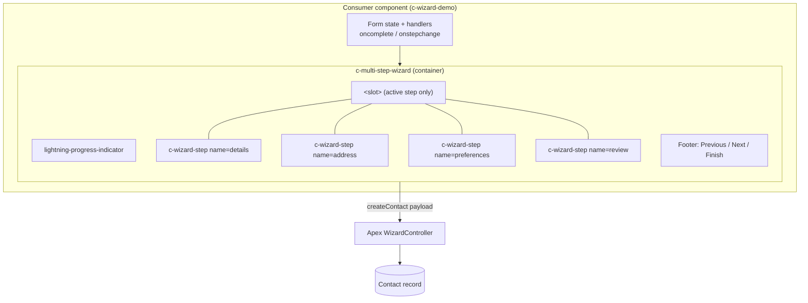
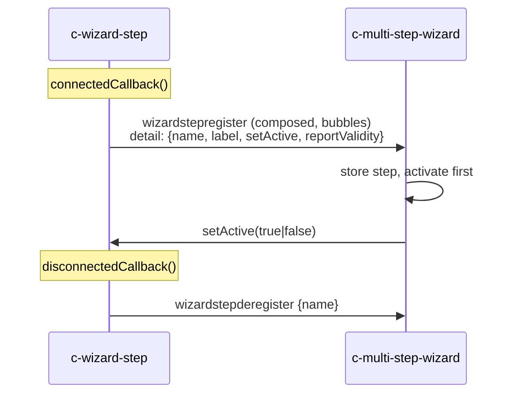
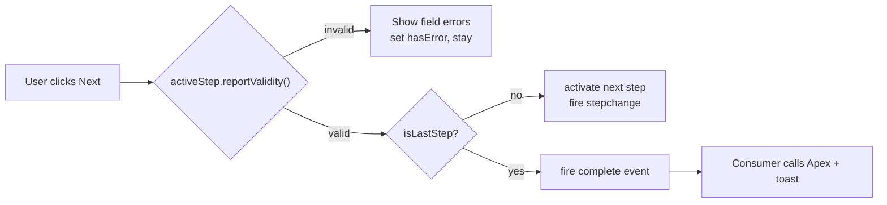

# Architecture — Multi-Step Wizard

A rendered diagram is available at [architecture.svg](architecture.svg). The
Mermaid sources below are the maintainable version of the same picture.

## 1. Component composition

## 2. Registration & control handshake

The container never queries the DOM of its steps. Instead each step registers
itself, handing the container a pair of callbacks — the same pattern
`lightning-tabset` / `lightning-tab` use.

## 3. Navigation & validation flow

## Design rationale

| Decision | Why |
| --- | --- |
| **Slot-based composition** | Consumers own their fields and layout; the wizard stays domain-agnostic and truly reusable. |
| **Self-registration via composed events** | Decouples container from children across the shadow boundary — no `querySelector` into slotted DOM. |
| **Callbacks in the register payload** | Lets the container drive children (`setActive`, `reportValidity`) without a pub/sub library. |
| **Validation delegated to the active step** | Each step validates its own slotted inputs generically (anything exposing `reportValidity`). |
| **Thin Apex with CRUD/FLS checks** | Keeps business logic server-side and enforces `with sharing` + object security. |
| **Public imperative API** | `next()/previous()/goToStep()/reset()` allow programmatic control and testing. |
